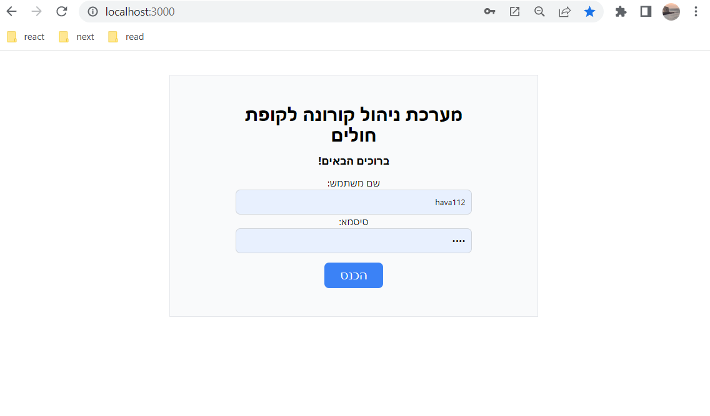
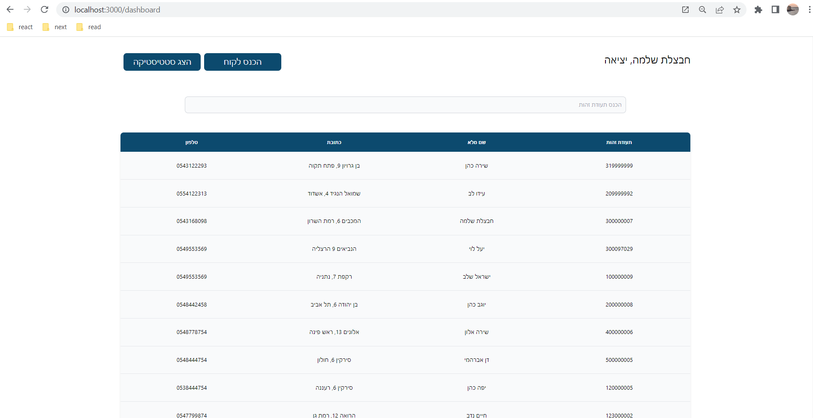
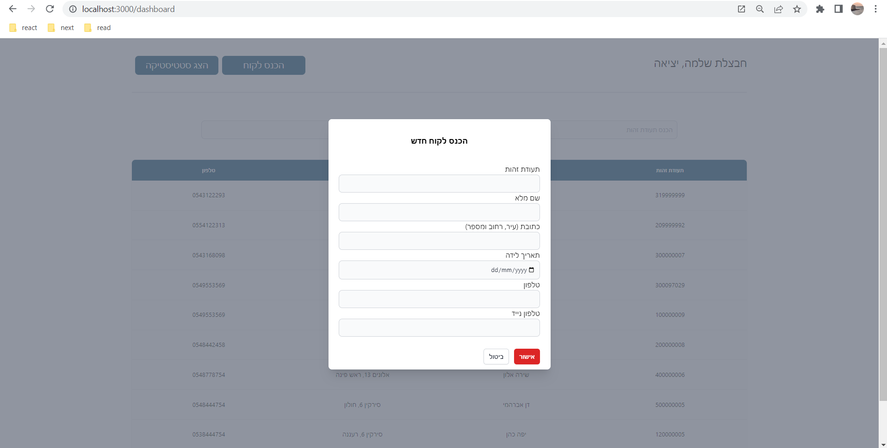
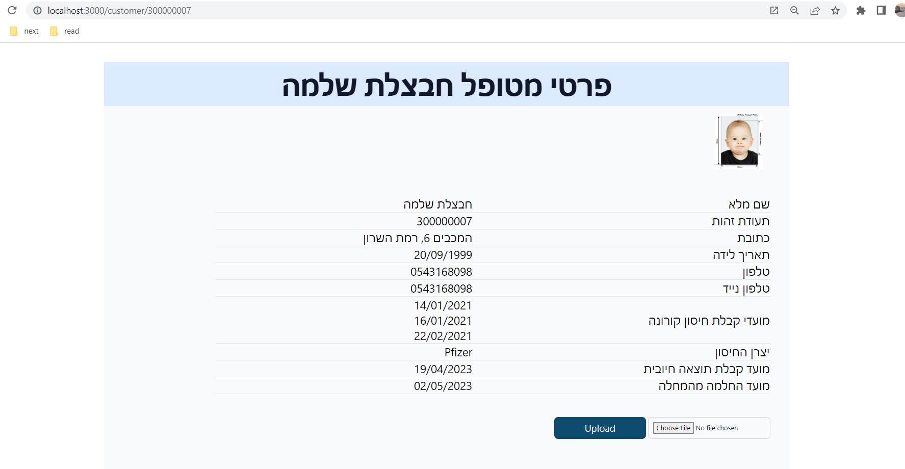
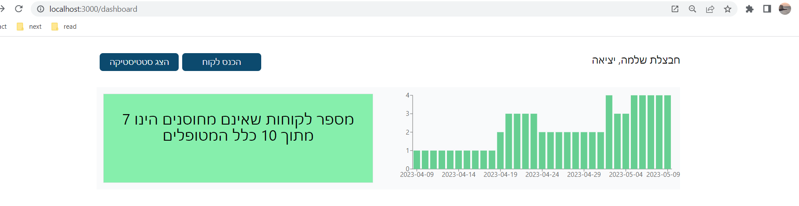

# Covid Management System

Covid-19 system management for a Health Fund

## Table of Contents

- [Overview](#overview)
- [System-requirements](#System-requirements)
- [Installation](#installation)
- [Usage](#usage)
- [Technologies Used](#technologies-used)
- [Output](#output)
- [Contributing](#contributing)
- [License](#license)

## Overview

Covid-19 management system allows you to view the list of patients in the health fund, add new clients to the system, view client details, add a picture of a patient and view statistics related to corona.

## System-requirements

 Before installation, make sure you have the following programs installed:
 * mongodb
 * npm
 * node

## Installation

To install the application, clone the repository and install the necessary dependencies using the following commands:

git clone https://github.com/havazelet/covid-management.git

cd covid-management

npm install

cd client

npm install

cd ../server

npm install

node createCovid19DB.js

The installation create default login user with the credential "username":"password"

## Usage

To start the application, run the following command under covid-management folder:

npm start

The application will be available at http://localhost:3000.

## Technologies Used

The project uses the following technologies:

- React for the client-side
- Node.js for the server-side
- MongoDB as the database

## Output
- Screenshots:
- 
- 
- 
- 
- 

## Contributing

Contributions to the project are welcome. To contribute, please follow these steps:

1. Fork the repository
2. Create a new branch for your feature or bug fix
3. Make your changes and commit them with descriptive commit messages
4. Push your changes to your forked repository
5. Submit a pull request to the main repository

## License

This project is licensed under the MIT license. See the [LICENSE](LICENSE) file for more details.